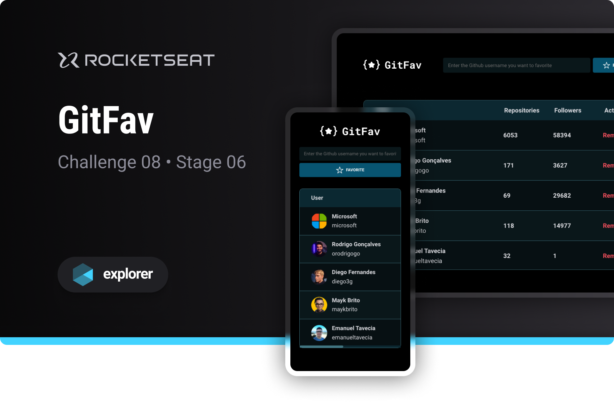

# 

Challenge developed on Rocketseat's Explorer course

**GitFav is a website that allows you to favorite GitHub users, designed to put into practice JavaScript programming concepts**

## 🔗 Project Links

- 🚀 [**Deploy**](https://emanueltavecia.github.io/gitfav)
- 🎨 [**Figma**](https://www.figma.com/file/SzQA07HwmSPj4hOYgu1Pps/%5BDesafios-Explorer%5D-GitFav/duplicate)

## 📋 Project information

- Rocketseat Explorer
- Stage 06
- Challenge 08

## 📝 Instructions for use

- Enter a GitHub username in the search input and click Favorite
- Add as many favorites as you want!
- You can remove a user at any time, just click Remove

## 🧠 Concepts learned

The development of this challenge aims to put the following concepts into practice:

- Asynchronous JavaScript Programming
- Object Oriented Programming (OOP)
- Classes
- Immutability
- Local Storage
- Events and Interactivity
- API Consumption
- Promises
- HTML table

## 💻 Technologies

## 📄 License

This project is licensed under the MIT License - see the [LICENSE](./LICENSE) file for more details.
